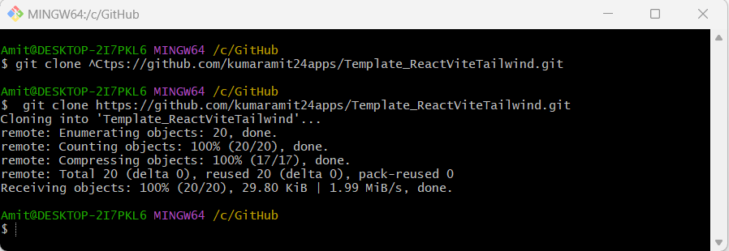
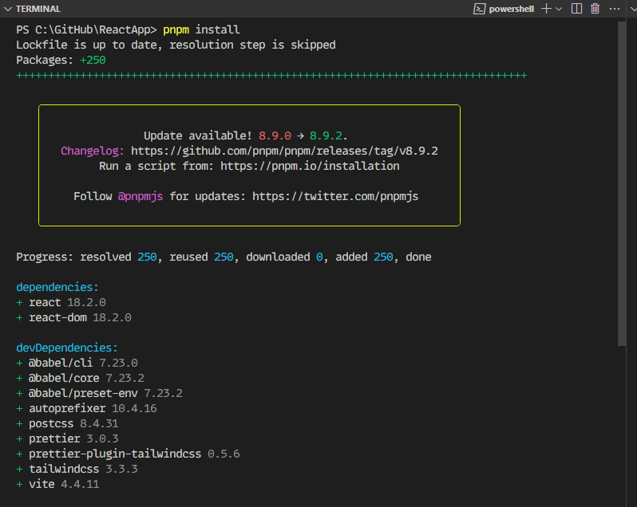

## Starter React Template with Tailwind & Vite

This starter template integrates Tailwind CSS, PostCSS, Prettier, and React to speed up development. It's powered by Vite.

## How can I quickly set this up locally?

I'm assuming that the latest version of Node.js is already installed on your system.

Continue with these steps:

1. Open your project root in the terminal.
1. Clone the repository using

   ```bash

       $ git clone https://github.com/kumaramit24apps/Template_ReactViteTailwind.git
   ```

   

1. You'll find a `Template_ReactViteTailwind` directory. Rename the directory to `ReactApp` (optional).
1. Open the `ReactApp` directory in your code editor.
1. In the terminal, navigate to this directory and install dependencies using your favorite package manager.
   I am using pnpm for this. You can follow `pnpm` [installation instructions](https://pnpm.io/installation) here.

   ```bash
       pnpm install
   ```

1. All the dependencies will be installed as follows:
   
1. Start the development server with `pnpm vite` or build for production with `pnpm vite build` in your terminal.

1. You're all set for hassle-free react development.

**Contributions are welcome via Pull Requests on GitHub.**
Follow @iAmitKumar on Twitter.
